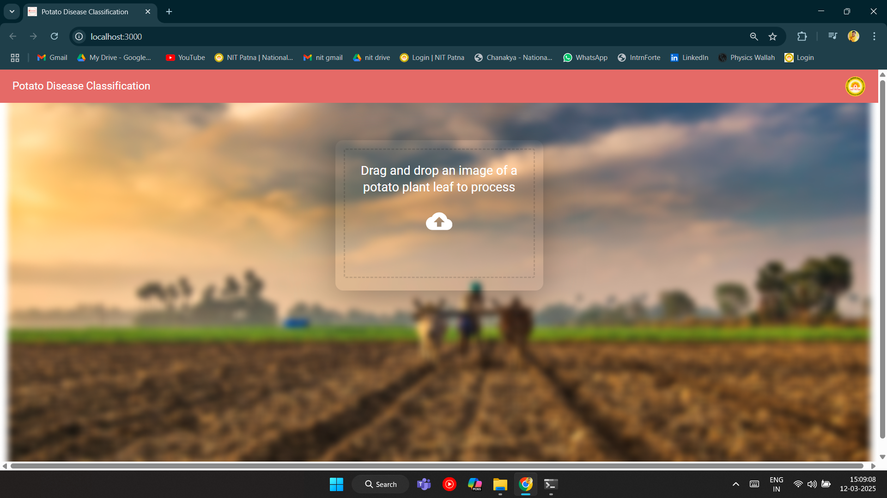
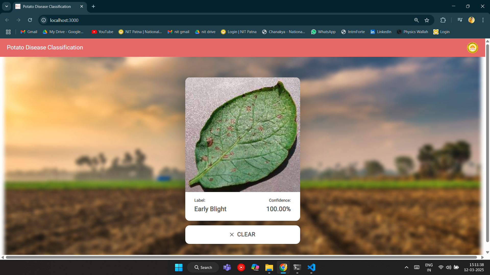
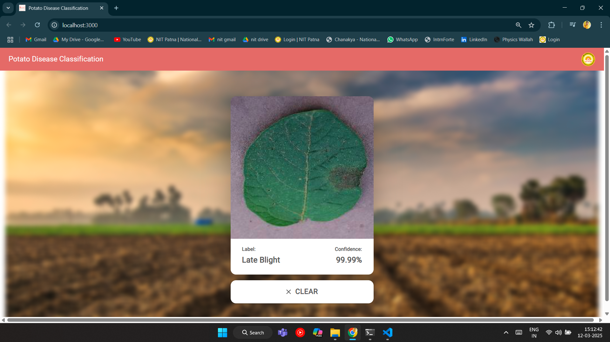
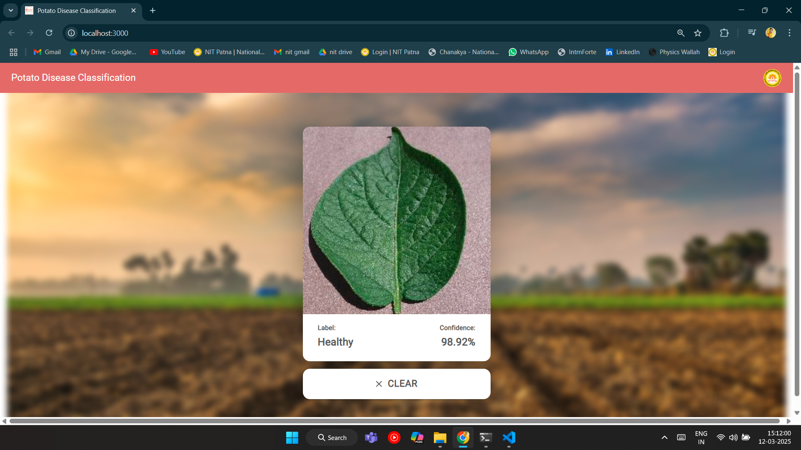
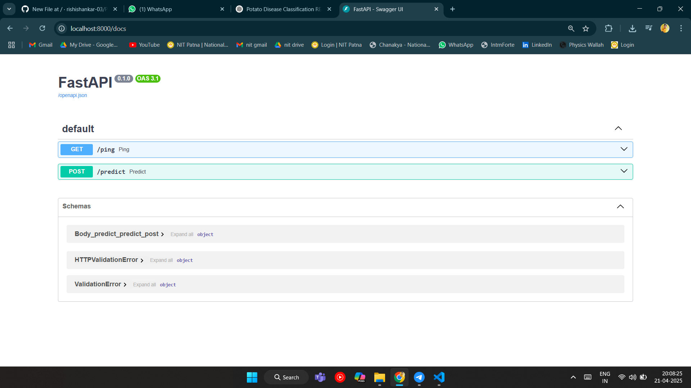
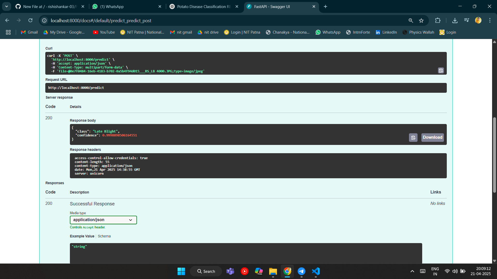

# 🥔 Potato Disease Classification using CNN (TensorFlow + FastAPI + Node.js Frontend)

This is a full-stack AI project to classify **potato leaf diseases** into three categories:

- ✅ **Healthy**
- ⚠️ **Early Blight**
- ❌ **Late Blight**

The system includes:
- 🧠 A **CNN model** built with **TensorFlow**
- 🚀 A **FastAPI** backend for image prediction
- 🌐 A **Node.js + HTML/CSS/JS** frontend for user interaction

---

## 📸 Screenshots

### 🔷 Frontend Screens

| Home Page | Early Blight Detection |
|-----------|------------------------|
|  |  |

| Late Blight Detection | Healthy Leaf Detection |
|------------------------|------------------------|
|  |  |

---

### 🟢 FastAPI Server Screens

| FastAPI Home Page (Swagger UI) | API Prediction Response |
|-------------------------------|--------------------------|
|  |  |

---

## 🧠 Model Details

- **Framework**: TensorFlow
- **Algorithm**: CNN (Convolutional Neural Network)
- **Classes**:
  - Early Blight
  - Late Blight
  - Healthy
- **Input**: Image of a potato leaf
- **Output**: Disease class + Confidence score

---

## 🛠 Tech Stack

### Backend
- Python
- TensorFlow
- FastAPI (REST API)
- Uvicorn (ASGI server)

### Frontend
- Node.js
- HTML / CSS / JavaScript

---

## ✅ Conclusion

This project demonstrates the power of deep learning in agriculture by accurately identifying potato leaf diseases through image classification. By combining a robust TensorFlow-based CNN model with a user-friendly web interface and FastAPI backend, this system provides an efficient, real-time tool that can assist farmers, researchers, and agronomists in early disease detection and crop health monitoring.

The modular architecture makes it easy to scale, deploy, and enhance in the future with more disease categories, mobile support, or integration with smart farming platforms.

